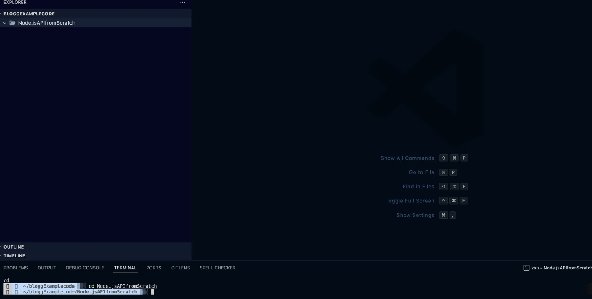
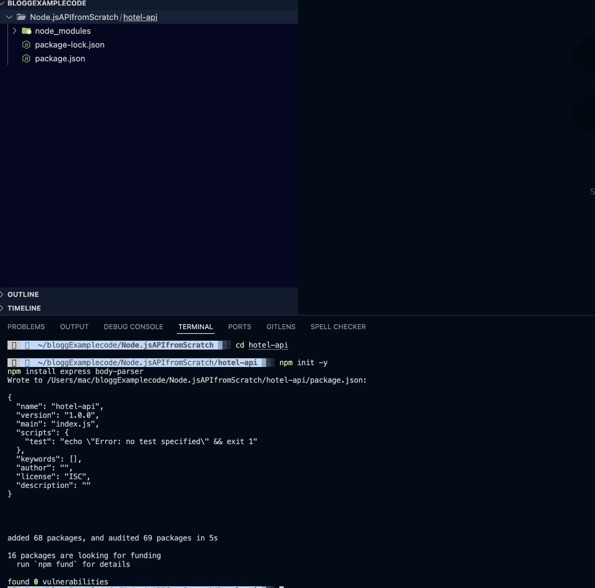
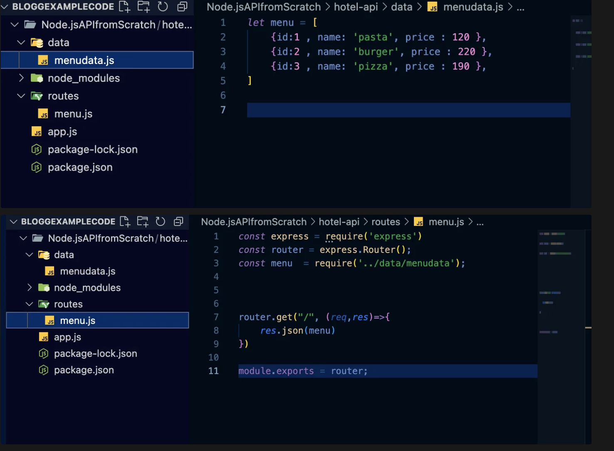
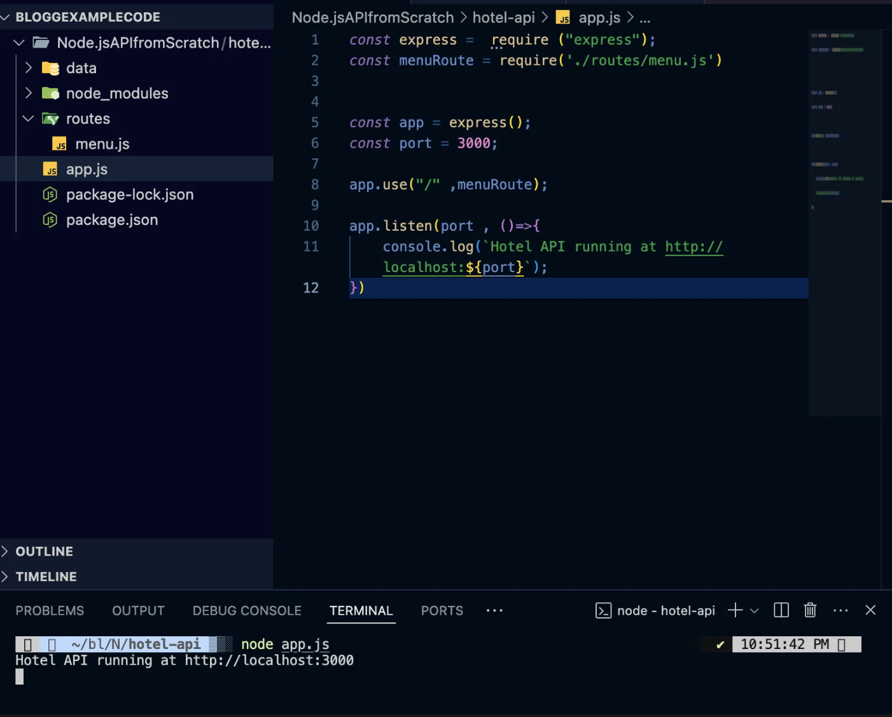
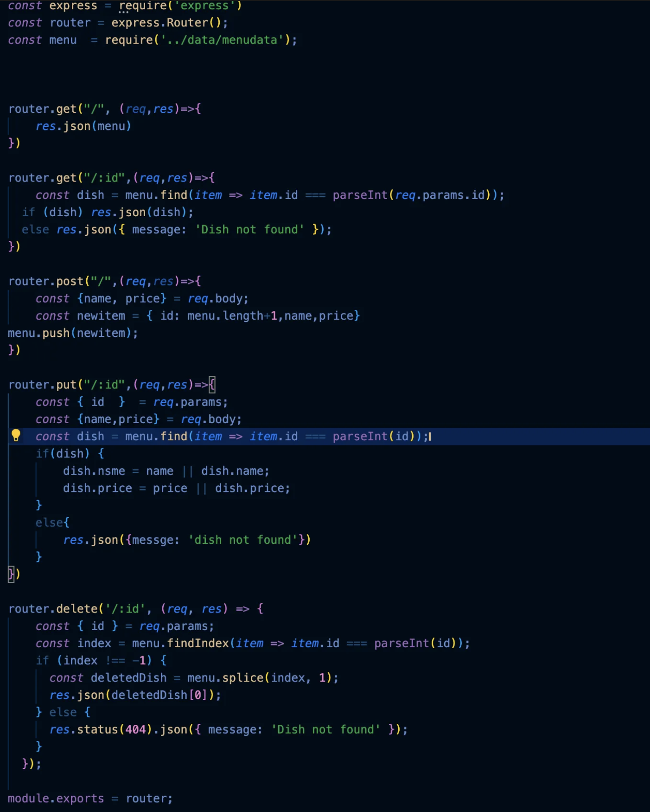
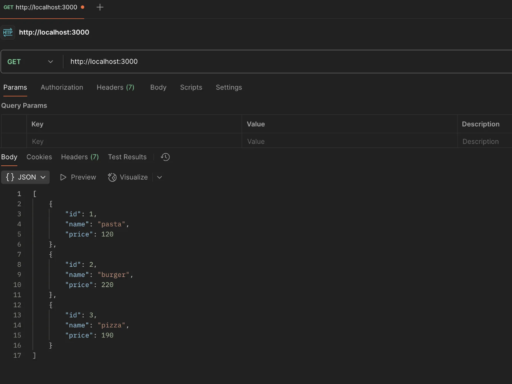
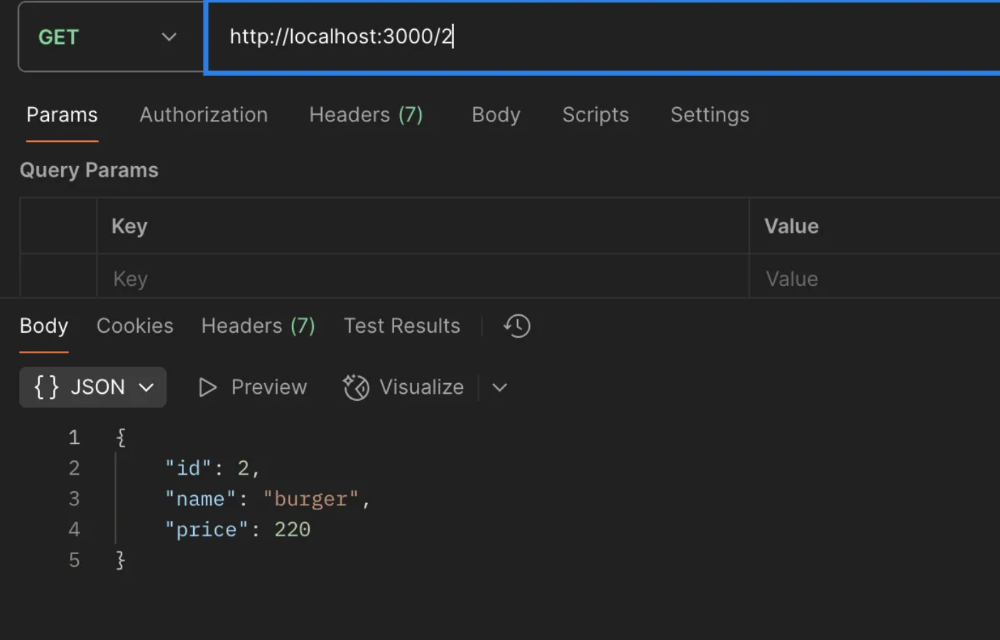
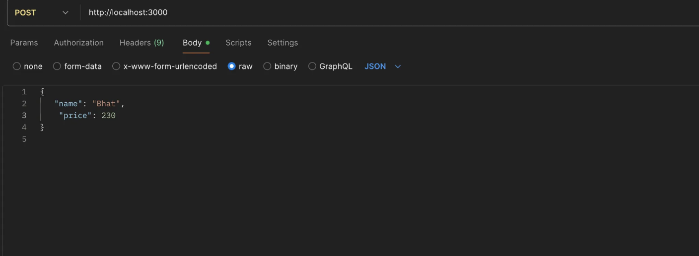
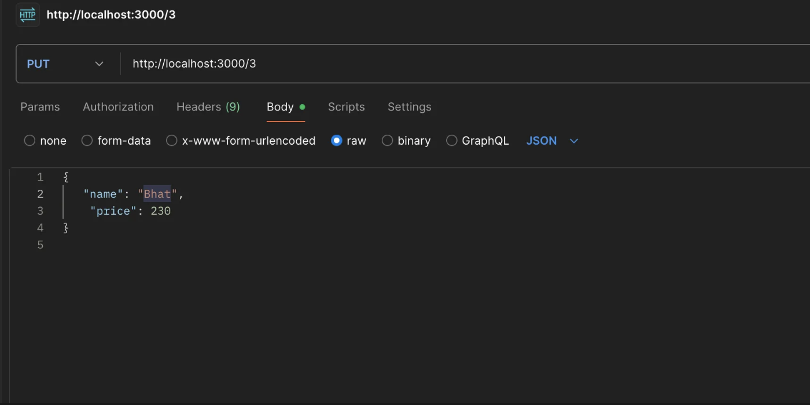
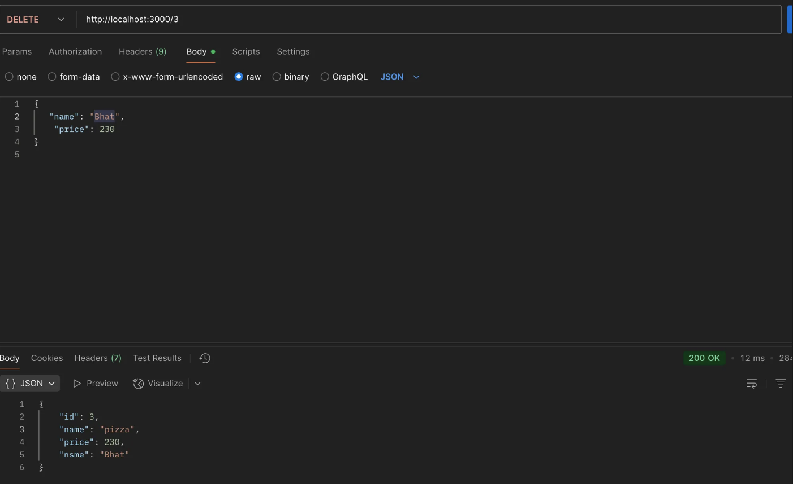

---

title: "How to Build Your First Node.js API with Express and Handle Data Efficiently"
description: ""
pubDate: "2025-09-08"
tags: ["Nodejs", "Development"]
---

If you're a web developer or someone working in the tech field, you've likely heard about APIs. In this blog, we will dive deep to understand what APIs are and how they work in the modern tech world.

API stands for **Application Programming Interface**, and it is basically used for communication or sharing data between the frontend, backend, and database. Let’s take a simple example of a hotel: When you visit a hotel for dinner, you don’t go into the kitchen to cook your food yourself. Instead, you look at the menu, place your order with the waiter, and then the kitchen prepares your meal. Finally, the waiter delivers the food to your table.

In this analogy:

- **You** are the frontend (the part the user interacts with).  
- **The waiter** is the API (it takes your request, communicates with the kitchen, and brings back the response).  
- **The kitchen** is the backend or database (where all the actual processing and data storage happen).

Just like the waiter acts as a bridge between you and the kitchen, an API acts as a bridge between the frontend and backend of a software application. It allows different parts of a system, or even different systems, to communicate and share data efficiently.

Let’s build the Node API and understand more about it.

---

## Step 1: Create a Node Application



This is the initial IDE I used: VS Code.

**Note:** You need to have Node.js installed on your local machine. You can download it from [here](https://nodejs.org/en/download).

Run the following commands in your terminal:

```bash
mkdir hotel-api
cd hotel-api
npm init -y
npm install express body-parser
```

This downloads the Node modules and creates the package.json file, which contains all the dependencies as show below.



---
## Step 2: Creating the Route and Data Files

After completing Step 1, create two files: one for data and another for routing. The data file will hold your sample data, and the routing file will define the API endpoints to handle requests.


The menu data is saved in the data file, and the routing file handles the API endpoints, directing requests to the appropriate data or actions.
After installing the Node modules and creating the package.json file, create app.js, which will serve as the entry point of your application. Then run node app.js to start the Node.js server.






Now let's see how it works by using Postman to test our API.

### 1.GET Request - Get All Menu Items

  Here check for the GET request at localhost:3000/menu. This endpoint retrieves all menu items from the hotel menu.

    URL: http://localhost:3000/
 Method: GET



### 2.GET Request by ID

To get a specific menu item by its ID.

    URL: http://localhost:3000/1

Method: GET
Expected Response:

    { "id": 1, "name": "Burger", "price": 10 }




### 3.Post Request - Add New Menu Item

   To add a new item to the menu.

     URL: http://localhost:3000



 ### 4.Put a Menu Item (PUT)

   Send a PUT request to:
    
    http://localhost:3000/3
 

   with updated JSON data:

    {
    "name": "bhat",
    "price":  230
     }  




### 5. Delete a Menu Item <br>
Send a DELETE request to:

       http://localhost:3000/3




Now you have a working Node.js API with Express that can handle GET, POST, PUT, and DELETE requests. You can expand this API further by adding more routes, integrating with a database, or adding authentication!