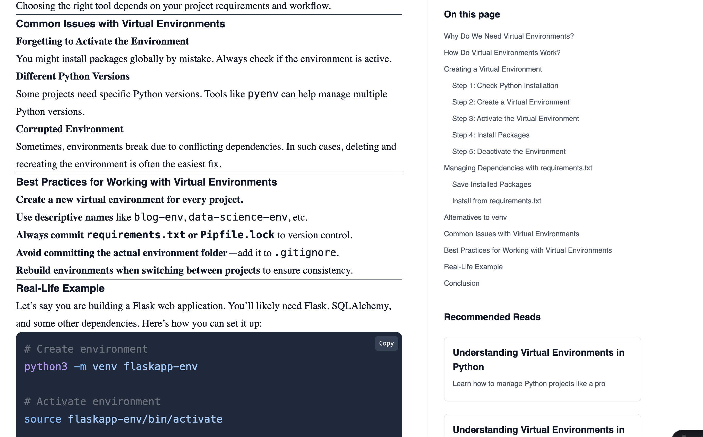

# 🐍 Understanding Virtual Environments in Python

Python is one of the most popular programming languages, loved for its **simplicity**, **readability**, and **rich ecosystem** of libraries.  

But as you work on multiple projects, a problem arises:  
👉 *How do you manage different dependencies for different projects without conflicts?*  

This is where **Virtual Environments** come in.  
They let you create **isolated spaces** for each project, ensuring smooth development without "dependency hell."  

---

## 🚨 Why Do We Need Virtual Environments?

Imagine you are working on two projects:  

- **Project A** → Needs `Django 3.2`  
- **Project B** → Needs `Django 4.0`  

If you install Django globally:  
- Upgrading for Project B might **break Project A**.  
- Both projects share the same **global Python packages**, leading to conflicts.  

⚡ **Virtual environments solve this** by creating separate isolated environments.  


---

## ⚙️ How Virtual Environments Work

When you create a virtual environment, Python sets up a folder containing:  
- 🐍 A **Python interpreter copy**  
- 📦 A dedicated `site-packages` folder for libraries  
- 🎛️ Scripts to activate/deactivate the environment  

This ensures installed packages **only affect the environment**, not the global system.  

---

## 🛠️ Creating a Virtual Environment

Python (3.3+) includes the built-in `venv` module.  

### ✅ Step 1: Check Python Installation
```bash
python3 --version
```

### ✅ Step 2: Create Environment
```bash
python3 -m venv myenv
```

### ✅ Step 3: Activate Environment
- On **Linux/Mac**:
```bash
source myenv/bin/activate
```
- On **Windows**:
```bash
myenv\Scripts\activate
```

👉 Notice your terminal now shows `(myenv)` — you’re inside the environment.


### ✅ Step 4: Install Packages
```bash
pip install requests
```

### ✅ Step 5: Deactivate
```bash
deactivate
```

---

## 📋 Managing Dependencies with `requirements.txt`

It’s best practice to track dependencies.

### Save Installed Packages
```bash
pip freeze > requirements.txt
```

### Install from `requirements.txt`
```bash
pip install -r requirements.txt
```

This ensures **anyone can replicate the same environment** easily.  


---

## 🔄 Alternatives to `venv`

While `venv` is common, other tools provide extra features:  

| Tool        | Key Features | Best For |
|-------------|--------------|----------|
| **virtualenv** | Classic tool, lightweight | Legacy projects |
| **pipenv**    | Combines `pip` + `venv`, uses `Pipfile` | App development |
| **poetry**    | Dependency mgmt + packaging | Modern projects |
| **conda**     | Handles Python + non-Python libs | Data Science/ML |


---

## ⚠️ Common Issues

1. **Forgot to activate env** → packages install globally  
2. **Python version mismatch** → use `pyenv` for multiple versions  
3. **Corrupted env** → delete and recreate the environment  

---


## 🌟 Best Practices

- ✅ Create a new env **per project**  
- ✅ Use **descriptive names** (`blog-env`, `data-env`)  
- ✅ Add `env/` folder to `.gitignore`  
- ✅ Commit only `requirements.txt`  

---

## 🚀 Real-Life Example: Flask App

```bash
# Create environment
python3 -m venv flask-env

# Activate
source flask-env/bin/activate

# Install dependencies
pip install flask sqlalchemy

# Save
pip freeze > requirements.txt
```

Later, a teammate can do:
```bash
pip install -r requirements.txt
```


---

## 🏁 Conclusion

Virtual environments are **essential for every Python developer**.  
They help you:  
- Isolate dependencies  
- Avoid version conflicts  
- Improve collaboration  
- Ensure reproducibility  

👉 Whether you use `venv`, `pipenv`, `poetry`, or `conda`, the rule is simple:  
**Never code in Python without a virtual environment.**

---
